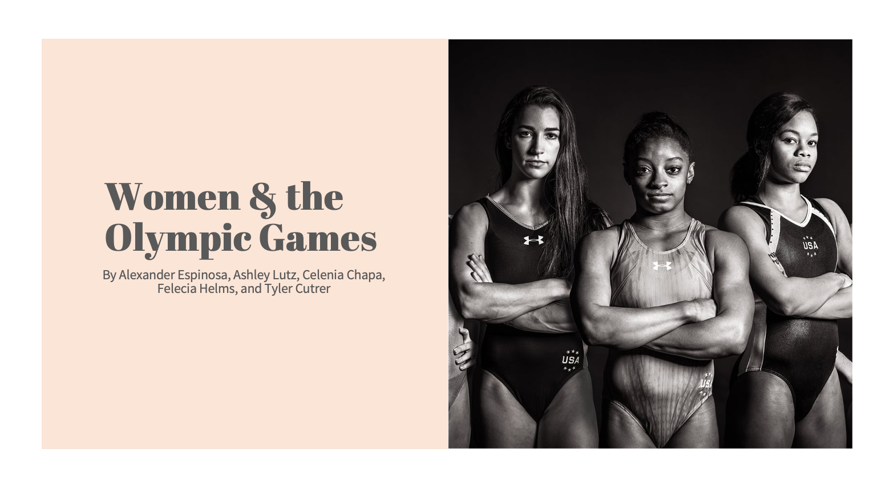

# Git Sum Group Project: Women & the Olympic Games

## Our Questions

* Did Women’s participation in the Olympic Games change over the years?
* Which sports had the biggest increase in Women participation in relation to the women’s movement?
* What is the average age of a Female Olympian and does this average age change depending on country?
* Did world events affect the performance of Olympic Athletes?

## Our Analysis

<h4 style="color:#F09789">Participation Analysis</h4>

When we review historical events that have occurred throughout the USA we wanted to know if they correlated with women’s participation in the Olympics and if its participation had changed over time. Historical events such as women’s right to vote, equal pay, and the women’s rights movement, correlates with the increase in women’s participation throughout the 1900s on to recent years.
 

We also wanted to analyze other world nation’s participation in the Olympics and if these events also correlated with change in women's participation. China had gone through historical events such as their Civil War during 1945-49, Russia had their Russian Revolution in 1917 along with their Soviet Union rule, and Japan had dealt with the aftermath of WWII. Overall, we did see a variation in participation throughout the 1900s on to recent years and noticed that women’s participation had increased in the recent years. This increase could be in correlation with the overall cultural shift for more women’s rights and equality.

It can be concluded for this observation that historical events do appear to correlate with Olympic participation, but we also know that we have limitations. There are many factors to take into consideration such as the variety in historical events, cultural shifts, and the rise and fall of governments and regimes.

<h4 style="color:#F09789">Sports Category Analysis</h4>

Content in progress.

<h4 style="color:#F09789">Age Analysis</h4>

My beginning question was what is the average age of a Female Olympian and doesthis average age change depending on the country? (Due to time constraints, I only focused on China, Russia, and Japan)

The initial CSV was created to record everyone that competed in the Olympics from 1896 to 2016. To perform data cleanup, I initially narrowed it down to the specific country that I wanted to analyze and drop. After this, I added a filter to only pull the female Olympian data and dropped any duplicated information. In this case, the duplicates occurred due to an athlete having competed in multiple events in the same Olympics. In this way, I was able to keep my data from being skewed.

According to scholarly articles, 26.1 is the average age of peak performance in Olympic Athletes. This is an average value that does tend to fluctuate depending on the sport itself with a range of anywhere between 21 to 27 years old. After reviewing the overall Ages for Olympians from 1896 to 2016, I was able use the data cleanup method described above to create a line graph that compares the average ages of the Male and Female Olympians from the United States. This graph shows a clear distinction of at least 1-2 years. The analysis conveyed that Male Olympians have an average age of 26.4 and Females have an average age of 24.7.

After finding this data, I then used matplotlib to create line graphs to compare the US Female Olympian Age data to China, Russia, and Japan. Each country showed roughly the same trend of having younger female Olympians than the US did. The most notable of these graphs was the comparison between China and the US with the average female Chinese Olympian age having an average age of 22.8. Both Russia and Japan showed similar trends until roughly 2005 where the average became almost identical between the three countries. Female Russian Olympians had an average age of 25.0 while female Japanese Olympians had an average age of 22.4 due to several decades having younger female teams like the Chinese team.

Due to time limitations, I was unable to continue developing my analysis. I would have liked to analyze Average Age of Females who Won Gold as well as analyze of the Average Age of Female Olympians for each individual sport as well.

<h4 style="color:#F09789">Medals Analysis</h4>

** Note medal count includes the Winter Olympics

What I had to do is breakdown the winners based upon country and from there of course separate it by gender. After breaking it down from there we took the original data and only kept the year and the medals won. I did print the years to their own list but I ended not needing this step, when later I setup the new Data Frame to use the index of year. Before reaching that step, I did separate the three medals into their own lists and then use that list to create the Data Frame after renaming the columns. We then create the medal counts based upon year, and medal won. For some additional cleanup we set any "NAN" to hold a zero value in its place and of course created everything as an integer, since the numbers were so well rounded and then created our line graphs.

We created some great visuals but what do they mean, well we can see with greater performance from the women in the United States that we start claiming more medals. Within some years, The United States Women's Team leads in performance for all three-medal count over the men. Showing that while there were still struggles, the success of the United States Women's Team led the world. Among two of the three countries added for comparison. We see Japan does not have much success until the later part of their women's suffrage, after World War II. China did not even come back to the Olympics until the 1984 Summer Games. Lastly, we compared it to Russia, who have been allowing women to compete for just about the same time as we have. They do have a pretty good track record of success compared to our Women's Team.

## Conclusions

Content in progress.

## Our Data Set

Our data set came from the following source: 

<a href="https://www.kaggle.com/heesoo37/120-years-of-olympic-history-athletes-and-results" title="120 years of Olympic history: athletes and results" target="_blank" style="color:#6990A4">120 years of Olympic history: athletes and results</a>

## Additional Resources

<a href="https://www.huffingtonpost.ca/2012/07/25/peak-age-for-athletes_n_1699631.html" title="Peak age for Olympic Athletes" target="_blank" style="color:#6990A4">Peak age for Olympic Athletes</a>

<a href="https://www.bitchmedia.org/article/forgotten-history-female-athletes-who-organized-their-own-olympics" title="The Forgotten History of Female Athletes Who Organized Their Own Olympics" target="_blank" style="color:#6990A4">The Forgotten History of Female Athletes Who Organized Their Own Olympics</a>

<a href="https://www.eeoc.gov/statutes/title-vii-civil-rights-act-1964" title="Title VII of the Civil Rights Act of 1964" target="_blank" style="color:#6990A4">Title VII of the Civil Rights Act of 1964</a>

<a href="https://www.theguardian.com/sport/ng-interactive/2018/feb/08/winter-olympics-womens-long-race-to-parity" title="Winter Olympics: womens long race to parity" target="_blank" style="color:#6990A4">Winter Olympics: womens long race to parity</a>

<a href="https://www.bbc.com/news/world-us-canada-57937102" title="Gender disparities still vex Tokyo Olympic Games" target="_blank" style="color:#6990A4">Gender disparities still vex Tokyo Olympic Games</a>

<a href="https://www.jhse.ua.es/article/view/2019-v14-n3-women-athletes-olympic-games" title="Women Athletes in the Olympic Games" target="_blank" style="color:#6990A4">Women Athletes in the Olympic Games</a>

<a href="https://www.history.com/topics/womens-history/the-fight-for-womens-suffrage" title="Women’s Suffrage" target="_blank" style="color:#6990A4">Women’s Suffrage</a>

<a href="https://borgenproject.org/womens-rights-in-russia/" title="5 Facts about Women’s Rights in Russia" target="_blank" style="color:#6990A4">5 Facts about Women’s Rights in Russia</a>

<a href="https://www.thoughtco.com/international-woman-suffrage-timeline-3530479" title="The Olympic Boycott, 1980" target="_blank" style="color:#6990A4">The Olympic Boycott, 1980</a>

<a href="https://www.thoughtco.com/international-woman-suffrage-timeline-3530479" title="Chinese Civil War 1945-1949" target="_blank" style="color:#6990A4">Chinese Civil War 1945-1949</a>

<a href="https://www.insider.com/when-women-around-the-world-got-the-right-to-vote-2019-2" title="When women got the right to vote in 25 places around the world" target="_blank" style="color:#6990A4">When women got the right to vote in 25 places around the world</a>

<a href="https://www.japantimes.co.jp/life/2004/10/07/language/a-womans-happiness-is-in-the-home-huh/" title="A woman's happiness is in the home . . . huh?" target="_blank" style="color:#6990A4">A woman's happiness is in the home . . . huh?</a>

<a href="http://www.crosscurrents.hawaii.edu/content.aspx?lang=eng&site=japan&theme=work&subtheme=WOMEN&unit=JWORK002" title="Introduction of Female Suffrage" target="_blank" style="color:#6990A4">Introduction of Female Suffrage</a>

<a href="https://borgenproject.org/womens-rights-in-china/" title="The Fight for Women’s Rights in China" target="_blank" style="color:#6990A4">The Fight for Women’s Rights in China</a>

 

